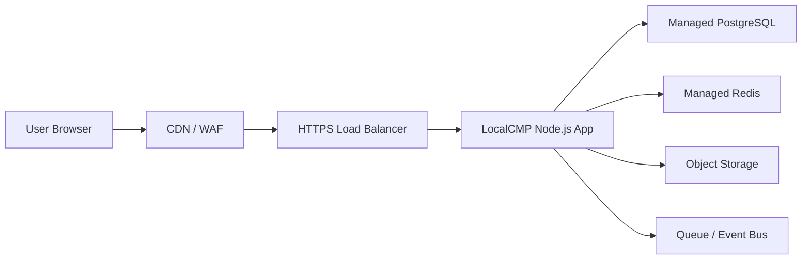

# CMP 前端云端部署说明

## 1. 适用对象

本文面向前端开发、前端部署和联调人员，说明当前 LocalCMP 阶段一原型如何部署到云端环境。

当前项目由两部分组成：

- `frontend/`：静态前端资源，包含 `index.html`、`app.js`、`styles.css`、`privacy.html`。
- `backend/`：Node.js 模块化单体 API，同时也可以托管 `frontend/` 静态文件。

阶段一推荐先采用“后端同源托管前端”的方式上线测试，减少跨域、Cookie、CSP 和 API Base URL 配置复杂度。

## 2. 部署模式选择

### 2.1 推荐模式：同源部署

访问方式：

```text
https://cmp.example.com/
https://cmp.example.com/api/v1/health
```

特点：

- 前端和 API 同域名、同协议、同端口。
- `frontend/app.js` 在非 `file://` 场景下会自动使用 `/api/v1`。
- 不需要额外配置 CORS。
- Cookie、CSP、审计、反向代理日志更容易统一。

适用场景：

- 内部测试环境。
- Staging。
- 第一版生产试运行。

### 2.2 可选模式：前后端分离部署

访问方式：

```text
https://cmp-web.example.com/
https://cmp-api.example.com/api/v1
```

当前前端代码默认只在 `file://` 本地预览时使用 `http://localhost:8080/api/v1`，云端前后端分离时需要补充运行时配置，例如：

- 在 `frontend/app.js` 中读取 `window.__LOCALCMP_CONFIG__.API_BASE`。
- 或在构建/发布阶段注入 `config.js`。
- 后端 CORS 需要明确允许前端域名。

前后端分离适用于后续 CDN、多区域静态加速、独立前端发布节奏等场景。

## 3. 云端推荐架构



阶段一最小可用部署：

- HTTPS Load Balancer。
- Node.js App 容器或 PaaS 服务。
- 托管 PostgreSQL，后续替换当前内存 seed。
- 对象存储，用于未来 CDR 文件、账单 PDF、批量文件。
- 监控与日志服务。

当前代码仍使用 `backend/data/seed.json` 内存数据，重启后运行期新增数据不会持久化。生产上线前必须接入真实数据库。

## 4. 构建与启动

当前项目没有前端打包步骤，前端是静态文件。

本地检查：

```powershell
npm run check
```

启动服务：

```powershell
npm start
```

默认端口：

```text
8080
```

云端启动命令：

```bash
npm start
```

健康检查路径：

```text
/api/v1/health
```

容器或 PaaS 平台应将外部 HTTPS 流量转发到应用内部端口 `8080`，也可以通过环境变量 `PORT` 修改端口。

## 5. 环境变量

当前已支持：

| 变量 | 示例 | 说明 |
| --- | --- | --- |
| `PORT` | `8080` | Node.js 服务监听端口 |
| `DATABASE_URL` | `postgres://...` | 启用 PostgreSQL 持久化 |
| `JWT_SECRET` | 随机强密钥 | JWT 签名密钥，生产必须配置 |
| `ALLOW_HEADER_AUTH` | `false` | 仅本地调试可设为 `true` |

生产环境后续应增加：

| 变量 | 说明 |
| --- | --- |
| `DATABASE_URL` | PostgreSQL 连接串 |
| `REDIS_URL` | 缓存、限流、队列辅助 |
| `JWT_ISSUER` | 登录 Token 签发方 |
| `JWT_AUDIENCE` | API Token 受众 |
| `OBJECT_STORAGE_BUCKET` | CDR、账单、批量文件存储桶 |
| `SMTP_HOST` | 账单邮件发送服务 |
| `KMS_KEY_ID` | 供应商凭证和客户密钥加密 |

敏感变量必须通过云平台 Secret Manager 或 KMS 注入，不要写入前端代码、Git 仓库或镜像明文层。

## 6. HTTPS 与安全要求

云端必须使用 HTTPS。

前端相关要求：

- 不允许使用 `http://` 生产域名。
- Cookie 同意弹窗必须保留。
- 隐私政策页面 `privacy.html` 必须可访问。
- CSP 由后端静态托管响应头提供，当前限制为 `self` 资源。
- 如果引入第三方字体、图标、分析脚本或 CDN，需要同步更新 CSP。
- 危险操作确认、表单校验和即时反馈不能在部署版本中移除。

后端反向代理建议增加：

```text
Strict-Transport-Security: max-age=31536000; includeSubDomains
X-Content-Type-Options: nosniff
Referrer-Policy: strict-origin-when-cross-origin
```

## 7. 前端 API Base URL

当前逻辑位于 `frontend/app.js`：

```javascript
const configuredApiBase = window.__LOCALCMP_CONFIG__?.API_BASE;
const API_BASE = configuredApiBase || (window.location.protocol === "file:" ? "http://localhost:8080/api/v1" : "/api/v1");
```

因此：

- 本地直接打开 `file:///.../frontend/index.html` 时，会调用 `http://localhost:8080/api/v1`。
- 云端通过 `https://cmp.example.com/` 访问时，会调用同源 `/api/v1`。

前端部署人员如果选择前后端分离，需要先和后端确认 API 域名，并增加运行时配置能力。

当前已提供 `frontend/config.js`：

```javascript
window.__LOCALCMP_CONFIG__ = {
  API_BASE: ""
};
```

同源部署时保持空字符串即可；前后端分离部署时，将 `API_BASE` 改为 API 域名，例如 `https://cmp-api.example.com/api/v1`。

## 8. 静态资源缓存策略

当前文件名没有 hash，建议缓存策略：

| 路径 | Cache-Control |
| --- | --- |
| `/index.html` | `no-cache` |
| `/privacy.html` | `no-cache` |
| `/app.js` | `no-cache` 或短缓存 |
| `/styles.css` | `no-cache` 或短缓存 |

如果后续引入构建工具并输出带 hash 的资源，可以将 JS/CSS/图片设置为长期缓存。

## 9. 部署步骤

### 9.1 同源部署

1. 拉取代码。
2. 安装 Node.js 运行环境。
3. 设置 `PORT`。
4. 执行 `npm run check`。
5. 执行 `npm install` 安装 PostgreSQL 驱动依赖。
6. 设置 `DATABASE_URL` 和 `JWT_SECRET`。
7. 启动 `npm start`。
8. 将 HTTPS Load Balancer 指向服务端口。
9. 打开 `https://<domain>/api/v1/health` 检查 API。
10. 打开 `https://<domain>/` 检查登录页和前端页面。
11. 使用默认开发账号登录后，进入 Dashboard、SIM、API 与 Webhook 页面检查数据是否加载。
12. 执行 `npm run smoke` 验证 API 最小链路。

### 9.2 前后端分离部署

1. 将 `frontend/` 上传到 CDN 或静态托管服务。
2. 部署后端 API 到 `https://<api-domain>/api/v1`。
3. 增加前端运行时配置，设置 `API_BASE`。
4. 后端 CORS 白名单加入前端域名。
5. 检查 CSP 是否允许 `connect-src` 到 API 域名。
6. 验证登录、列表加载、SIM 操作、CDR 导入、Webhook 查询。

## 10. 上线前检查清单

- `npm run check` 通过。
- `/api/v1/health` 返回 `status: ok`。
- `/api/v1/openapi` 可访问。
- 首页首屏可以打开。
- Dashboard 数据加载成功。
- SIM 操作预览和提交有即时反馈。
- API 与 Webhook 页面能展示 API Client、Webhook、通知投递。
- Cookie 同意和隐私政策可访问。
- 生产域名使用 HTTPS。
- 浏览器 Console 无阻塞性错误。
- 移动端宽度下导航和表格可用。
- 反向代理保留 `X-Correlation-Id`。

## 11. 回滚策略

前端静态资源回滚：

- 保留上一版本 `frontend/` 文件。
- 发现页面阻断问题时，将静态文件回滚到上一版本。
- 清理 CDN 缓存。

同源 Node.js 应用回滚：

- 保留上一版本镜像或部署包。
- 回滚应用服务。
- 检查 `/api/v1/health`。
- 检查前端首屏和核心 API。

注意：当前阶段一内存数据不适合生产；接入数据库后，回滚必须遵守数据库迁移“先兼容、后清理”的原则。

## 12. 常见问题

### 页面能打开，但数据加载失败

检查：

- `/api/v1/health` 是否可访问。
- 前端实际请求地址是否为 `/api/v1`。
- 是否存在 CORS 或 CSP 拦截。
- 反向代理是否正确转发 `/api/v1/*`。

### 本地 file 打开时无法加载数据

需要先启动后端：

```powershell
npm start
```

然后再打开：

```text
file:///C:/Users/61004/Documents/localcmp/frontend/index.html
```

### HTTPS 页面请求 HTTP API 被浏览器拦截

这是 Mixed Content 问题。生产环境前端和 API 都必须使用 HTTPS。

### Cookie 弹窗或隐私政策缺失

不要删除 `privacy.html` 和首页 Cookie 授权组件。生产环境如果增加统计脚本，需要让用户先授权非必要 Cookie。

## 13. 当前限制

- 尚未接入真实 PostgreSQL，运行期新增数据不会持久化。
- 已支持 PostgreSQL JSONB 持久层，但还未拆分为正式 repository 和领域表。
- 已支持基础邮箱密码登录和 JWT，但尚未接入 MFA、SSO 或密码重置。
- 尚未实现真实邮件、Webhook 外发和供应商 API 调用。
- 尚未提供 Dockerfile 和 CI/CD 模板。
- 前后端分离部署需要补运行时 API 配置。

这些限制不影响前端人员进行页面部署、联调和演示，但不应直接作为生产商用版本上线。
