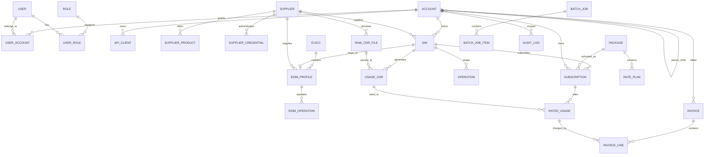

# CMP 数据库 ERD 与核心表设计

## 1. 设计原则

- 业务主数据使用关系型数据库，推荐 PostgreSQL 或兼容 PostgreSQL 的云数据库。
- CDR、用量、账单明细属于高 volume 数据，需要分区、冷热分层和归档。
- 所有账单、CDR、操作日志、审计日志都要求可追溯，不允许物理删除关键历史。
- 金额字段使用整数最小货币单位或 Decimal，不能使用浮点。
- 所有核心表包含 `id`、`created_at`、`updated_at`、`created_by`、`updated_by`、`tenant_account_id` 或可推导的租户字段。
- 所有外部请求和异步任务记录 `correlation_id`，便于排障。

## 2. Mermaid ERD 总览

## 3. 账户与权限域

### accounts

用途：账户树、Reseller 层级、客户账户、成本中心。

核心字段：

- id
- parent_account_id
- account_code
- account_name
- account_type: platform, reseller, customer, sub_account, cost_center
- account_status: draft, pending_review, active, suspended, closed
- risk_status: normal, credit_hold, compliance_hold, fraud_hold
- billing_status: current, overdue, dunning, bad_debt
- currency
- timezone
- billing_cycle_type: calendar_month, activation_day, contract_day, custom
- billing_day
- credit_limit_amount
- reseller_level
- path: 物化路径，例如 `/root/reseller_a/customer_b`
- data_retention_days

索引：

- `idx_accounts_parent`
- `idx_accounts_path`
- `idx_accounts_code_unique`

### users

用途：平台用户、客户用户、Reseller 用户。

核心字段：

- id
- email
- phone
- display_name
- user_type: human_user, support_user
- status: invited, active, locked, suspended, deactivated, deleted
- mfa_enabled
- last_login_at
- identity_provider
- external_subject

### user_accounts

用途：用户和账户授权关系。

核心字段：

- user_id
- account_id
- scope_type: self, subtree
- status

### roles / permissions / user_roles / role_permissions

用途：RBAC 模型。

权限命名建议：

- `sim.read`
- `sim.operate`
- `esim.profile.manage`
- `package.manage`
- `billing.read`
- `billing.issue`
- `supplier.manage`
- `account.create_child`
- `api_client.manage`
- `audit.read`

## 4. 供应商与资源域

### suppliers

用途：资源方主数据。

核心字段：

- id
- supplier_code
- supplier_name
- supplier_type: mno, mvno, aggregator, esim_provider, cdr_provider
- status
- api_base_url
- callback_url
- timezone
- default_currency
- sla_level

### supplier_credentials

用途：资源方鉴权配置。

核心字段：

- id
- supplier_id
- auth_type: api_key, oauth2, basic, certificate, sftp_key
- credential_name
- encrypted_secret_ref
- token_expired_at
- status
- last_rotated_at

### supplier_products

用途：资源方可售资源目录。

核心字段：

- id
- supplier_id
- supplier_product_code
- name
- country
- region_zone
- mcc
- mnc
- rat: 2g, 3g, 4g, 5g, nb_iot, lte_m
- apn
- validity_days
- quota_bytes
- fair_usage_policy
- supplier_cost_amount
- currency
- status

### supplier_api_logs

用途：记录资源方调用，排障和 SLA 统计。

核心字段：

- id
- supplier_id
- operation_type
- request_method
- request_url
- request_hash
- response_status
- response_hash
- latency_ms
- correlation_id
- error_code
- created_at

## 5. SIM 与码号域

### sims

用途：SIM/eSIM 对应网络身份。

核心字段：

- id
- account_id
- supplier_id
- iccid
- imsi
- msisdn
- eid
- imei
- sim_type: physical, esim_profile
- inventory_status: stock, reserved, assigned, recycled, retired
- service_status: not_started, pending_activation, test_ready, active, suspension_pending, suspended, resume_pending, termination_pending, terminated, failed
- service_status_reason
- country
- mcc
- mnc
- apn
- static_ip
- network_policy_id
- activated_at
- suspended_at
- terminated_at

说明：SIM 的库存状态和服务状态应分离建模，避免库存归属、网络服务、供应商操作状态混在一个字段中。完整状态机见 [账户用户权限套餐与号码状态深化设计.md](账户用户权限套餐与号码状态深化设计.md)。

索引：

- `idx_sims_account_status`
- `idx_sims_iccid_unique`
- `idx_sims_imsi`
- `idx_sims_msisdn`
- `idx_sims_eid`

### sim_groups

用途：按业务、项目、地区或客户自定义分组。

字段：

- id
- account_id
- name
- description
- group_type

### sim_group_members

字段：

- sim_group_id
- sim_id

### network_policies

用途：APN、漫游、限速、IMEI 绑定等策略。

字段：

- id
- account_id
- name
- allowed_regions
- allowed_mcc_mnc
- apn
- static_ip_enabled
- imei_lock_enabled
- throttling_policy
- roaming_enabled

## 6. eSIM 域

### euiccs

用途：eUICC/eID 设备身份。

字段：

- id
- account_id
- eid
- device_id
- manufacturer
- model
- rsp_mode: sgp22, sgp02, sgp32
- status
- last_seen_at

### esim_profiles

用途：eSIM Profile 库存。

字段：

- id
- supplier_id
- account_id
- euicc_id
- iccid
- imsi
- msisdn
- profile_type
- profile_state: available, allocated, downloading, installed, enabled, disabled, deleted, released, error
- smdp_address
- smsr_id
- eim_id
- activation_code_ref
- matching_id
- allocated_at
- installed_at
- enabled_at

### esim_operations

用途：eSIM 操作状态机。

字段：

- id
- account_id
- profile_id
- euicc_id
- operation_type: allocate, download, install, enable, disable, delete, swap, release, refresh_status
- operation_status: accepted, validating, submitted, processing, succeeded, failed, cancelled, timeout
- supplier_transaction_id
- idempotency_key
- request_payload_hash
- response_payload_hash
- error_code
- error_message
- correlation_id
- created_at
- completed_at

## 7. 套餐、订阅和计费域

### packages

用途：对客户销售的套餐产品。

字段：

- id
- package_code
- name
- package_type: data, sms, voice, esim_operation, bundle
- package_status: draft, pending_review, active, deprecated, retired, archived
- region_scope
- quota_bytes
- validity_type
- billing_start_type: calendar_month, activation_day, first_usage_day, contract_day
- pool_enabled
- overage_policy

### rate_plans

用途：套餐价格版本。

字段：

- id
- package_id
- version
- effective_from
- effective_to
- currency
- base_fee_amount
- included_quota_bytes
- overage_unit
- overage_price_amount
- tier_rules_json
- reseller_min_price_amount
- status: draft, scheduled, effective, expired, cancelled

### subscriptions

用途：账户/SIM 与套餐的订阅关系。

字段：

- id
- account_id
- sim_id
- package_id
- rate_plan_id
- status: pending_activation, active, suspended, pending_change, expired, cancelled, terminated
- start_at
- end_at
- billing_anchor_at
- auto_renew
- pool_id

### usage_pools

用途：流量池。

字段：

- id
- account_id
- package_id
- name
- quota_bytes
- used_bytes
- cycle_start_at
- cycle_end_at
- reset_policy
- overage_policy

## 8. CDR 与 Rating 域

### raw_cdr_files

用途：供应商原始 CDR 文件。

字段：

- id
- supplier_id
- file_name
- storage_uri
- file_hash
- record_count
- status: received, parsing, parsed, failed, archived
- received_at
- parsed_at

### usage_cdrs

用途：标准化 CDR。

建议按月份和 supplier/account 分区。

字段：

- id
- raw_file_id
- supplier_id
- account_id
- sim_id
- iccid
- imsi
- msisdn
- eid
- session_id
- usage_type: data, sms, voice, event, esim_operation
- start_time
- end_time
- country
- operator_name
- mcc
- mnc
- rat
- uplink_bytes
- downlink_bytes
- total_bytes
- chargeable_units
- raw_record_hash
- rating_status

### rated_usage

用途：计费后的用量。

字段：

- id
- usage_cdr_id
- account_id
- subscription_id
- package_id
- rate_plan_id
- rate_plan_version
- rated_units
- unit_price_amount
- amount
- currency
- supplier_cost_amount
- rating_time
- invoice_id
- status

## 9. Billing 域

### billing_profiles

字段：

- id
- account_id
- invoice_email
- billing_cycle_type
- billing_day
- tax_id
- tax_rate
- payment_terms_days
- invoice_language
- invoice_template_id

### invoices

字段：

- id
- account_id
- invoice_no
- invoice_period_start
- invoice_period_end
- status: draft, preview, approved, issued, sent, paid, voided
- currency
- subtotal_amount
- tax_amount
- total_amount
- due_at
- issued_at
- sent_at

### invoice_lines

字段：

- id
- invoice_id
- rated_usage_id
- line_type: subscription_fee, usage_fee, overage_fee, adjustment, tax, discount
- description
- quantity
- unit_price_amount
- amount
- currency

## 10. 批量、通知、审计域

### batch_jobs

字段：

- id
- account_id
- job_type
- status: uploaded, validating, waiting_approval, running, completed, failed, cancelled
- source_file_uri
- total_count
- success_count
- failed_count
- created_by
- approved_by
- started_at
- completed_at

### batch_job_items

字段：

- id
- batch_job_id
- row_no
- target_type
- target_key
- status
- error_code
- error_message
- operation_id
- result_json

### webhook_subscriptions

字段：

- id
- account_id
- event_type
- target_url
- signing_secret_ref
- status
- retry_policy

### audit_logs

字段：

- id
- account_id
- actor_type: user, api_client, system
- actor_id
- action
- resource_type
- resource_id
- before_hash
- after_hash
- ip_address
- user_agent
- correlation_id
- created_at
