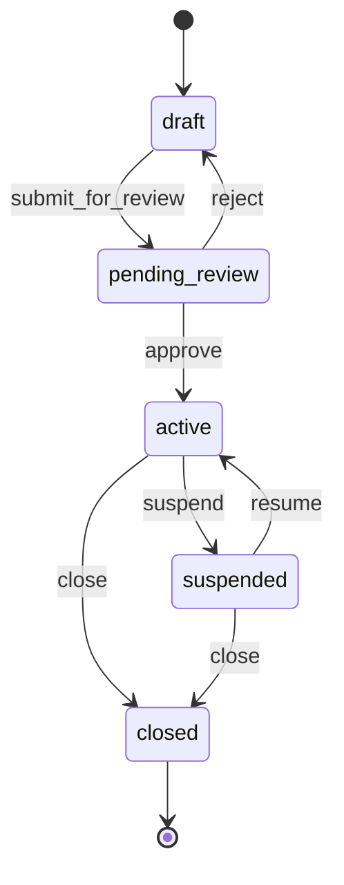
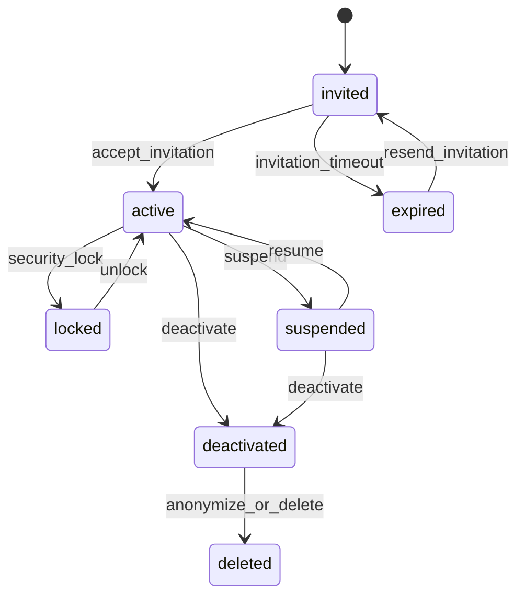
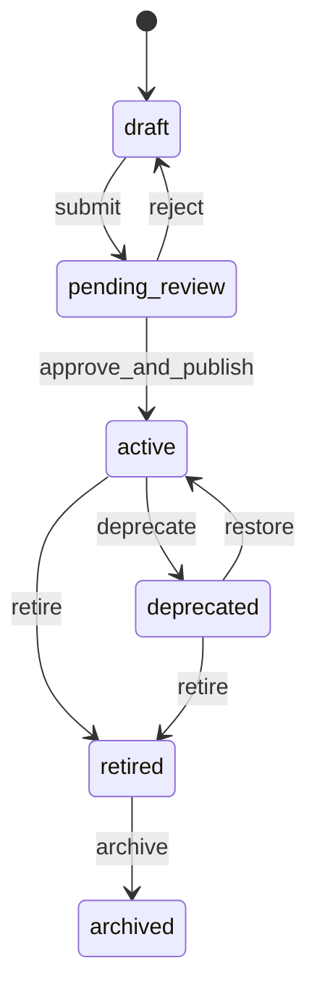
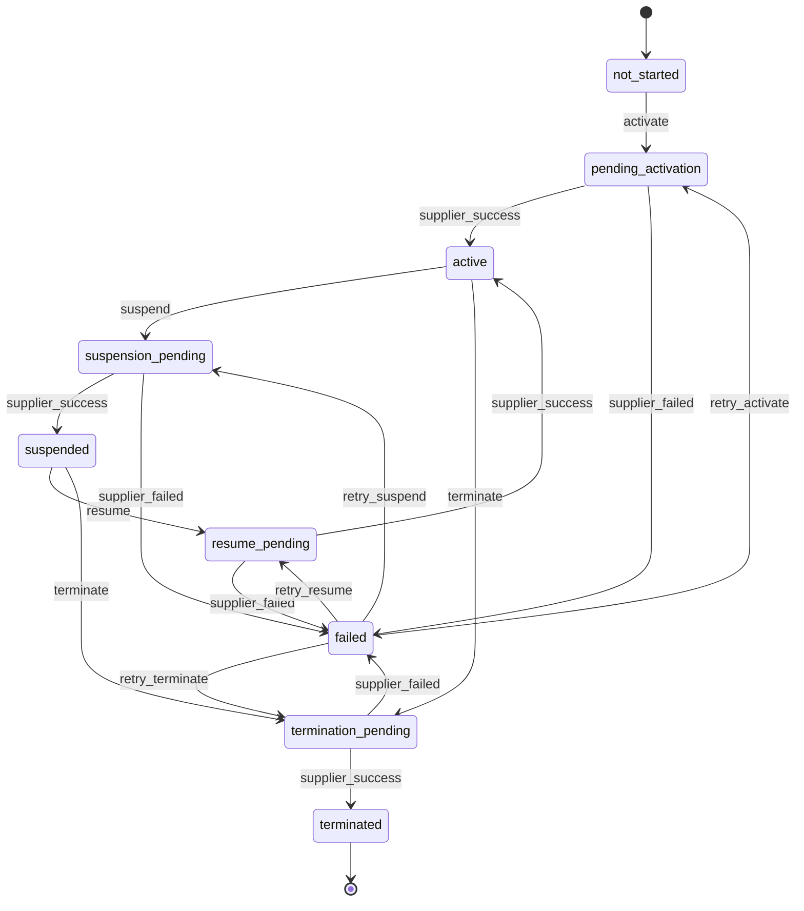

# 账户、用户、权限、套餐与号码状态深化设计

## 1. 设计范围

本文深化 CMP 平台中最核心的运营管理模块：

- 账户管理：平台、Reseller、客户、子账户的层级、状态和授权边界。
- 用户管理：用户生命周期、邀请、激活、冻结、离职、服务账号。
- 权限管理：RBAC、账户树范围、数据权限、审批权限和 API Scope。
- 套餐管理：套餐模板、价格版本、订阅、流量池、变更、续期、下架。
- 号码服务管理：SIM/码号开通、激活、暂停、恢复、终止、销户、回收的状态机。

## 2. 账户管理深化

### 2.1 账户类型

- platform：平台根账户，仅平台内部使用。
- reseller：代理账户，可创建下级 reseller 或 customer，具体层级由平台配置。
- customer：最终客户账户，拥有 SIM/eSIM、套餐、账单和 API。
- sub_account：客户下的部门、项目、业务线或成本中心。
- billing_entity：可选，独立开票主体，用于集团客户多主体账单。

### 2.2 账户状态

账户状态建议分为业务状态和风控/财务状态，避免一个字段承载所有含义。

业务状态 `account_status`：

- draft：草稿，资料未完整，不能开通服务。
- pending_review：待审核，等待平台或上级 Reseller 审批。
- active：正常，可使用服务。
- suspended：暂停，通常不允许新增激活，但历史数据可查看。
- closed：关闭，不再允许业务操作。

风控状态 `risk_status`：

- normal：正常。
- credit_hold：信用额度冻结。
- compliance_hold：合规冻结。
- fraud_hold：欺诈风险冻结。

财务状态 `billing_status`：

- current：账务正常。
- overdue：逾期。
- dunning：催收中。
- bad_debt：坏账。

### 2.3 账户状态流转



关键规则：

- draft 账户不能创建 SIM 订阅、API Key、账单运行。
- pending_review 账户只能补充资料和查看审核进度。
- active 账户允许正常业务操作。
- suspended 账户默认禁止新增开通、套餐变更、API 写操作；是否允许用量继续产生由暂停类型决定。
- closed 账户只保留历史查询、账单、审计和合规导出。
- 上级账户 suspended 时，下级账户默认继承服务限制，但可配置豁免白名单。

### 2.4 Reseller 层级规则

- 平台可配置最大 Reseller 层级，例如 3 级。
- Reseller 创建下级账户时，不能越权分配自己未拥有的套餐、区域、供应商资源或价格权限。
- Reseller 可设置下级客户销售价，但不能低于平台给定的最低价或合同底价。
- 下级账户的用量、收入、成本、毛利应向上聚合。
- 上级 Reseller 可查看下级账户的运营数据和账单汇总，但不可查看平台成本字段，除非被授予权限。

### 2.5 账户创建流程

1. 创建基础资料：名称、类型、上级账户、币种、时区、联系人。
2. 配置合同：账期、信用额度、付款条件、税务信息。
3. 分配产品权限：可售套餐、区域、供应商、价格版本。
4. 配置安全策略：MFA、IP 白名单、API 权限、SSO。
5. 提交审核。
6. 审批通过后进入 active。
7. 自动创建 Billing Profile、默认管理员邀请和默认 SIM 分组。

## 3. 用户管理深化

### 3.1 用户类型

- human_user：真人用户，登录管理后台。
- api_client：客户系统调用 API 的机器身份。
- service_account：内部服务账号，用于服务间调用。
- support_user：平台支持人员，可申请临时访问客户账户。

### 3.2 用户状态

- invited：已邀请，未完成注册。
- active：正常。
- locked：多次登录失败或安全策略锁定。
- suspended：管理员暂停。
- deactivated：离职或停用。
- deleted：逻辑删除，仅保留审计必要信息。

### 3.3 用户生命周期



关键规则：

- 用户必须绑定至少一个账户授权范围才能登录业务后台。
- 一个用户可属于多个账户，但每个账户下可有不同角色。
- 用户离职时应撤销 Session、API Token、审批权限和导出权限。
- support_user 访问客户账户必须走临时授权，记录原因、有效期和审计日志。

### 3.4 邀请与安全

- 邀请链接一次性使用，有效期建议 24-72 小时。
- 首次登录必须设置 MFA，可按账户安全策略强制。
- 高权限操作可要求二次验证，例如密码、MFA 或审批。
- 支持 SSO/OIDC/SAML 的客户可禁用本地密码登录。

## 4. 权限管理深化

### 4.1 权限模型

推荐采用：

```text
Permission = Action + Resource + Scope + Condition
```

示例：

- `sim.read` + `account_subtree:/A/B`
- `sim.activate` + `sim_group:logistics`
- `package.manage` + `owned_by_account`
- `billing.issue` + `account_self`
- `supplier.manage` + `platform_only`

### 4.2 标准角色

平台角色：

- Platform Owner：全局管理。
- Platform Ops：SIM/eSIM、批量、供应商日常运营。
- Platform Finance：价格、账单、结算、调整项。
- Platform Support：客户支持，只读加临时操作。
- Platform Auditor：审计只读。

Reseller 角色：

- Reseller Owner：管理本账户和下级账户。
- Reseller Admin：用户、套餐分配、SIM 管理。
- Reseller Finance：下级账单、利润、结算。
- Reseller Support：下级客户支持。

客户角色：

- Customer Owner：客户侧全权限。
- Customer Admin：用户、SIM、套餐、API。
- Customer Operator：SIM/eSIM 操作。
- Customer Finance：账单和用量成本。
- Customer Developer：API Key、Webhook、接口日志。
- Viewer：只读。

### 4.3 权限分层

- 菜单权限：是否显示模块。
- 页面权限：是否能进入页面。
- 操作权限：是否能点击激活、暂停、终止、账单发布等按钮。
- 数据权限：能看到哪些账户、SIM 组、套餐、账单、供应商。
- 字段权限：是否能查看成本、利润、供应商凭证、密钥明文片段。
- 审批权限：是否能审批高风险批量任务、账单发布、套餐价格生效。

### 4.4 高风险操作审批

建议进入审批流的操作：

- 批量终止号码。
- 批量暂停超过阈值数量的号码。
- 批量套餐价格变更。
- 已发布账单作废。
- 供应商凭证变更。
- 账户关闭。
- Reseller 最低价调整。

审批记录应包含：

- 申请人、审批人、审批时间。
- 操作前后摘要。
- 影响对象数量。
- 风险提示。
- 审批意见。
- correlation_id。

## 5. 套餐管理深化

### 5.1 套餐对象分层

- Package Template：套餐模板，描述业务形态，例如欧洲 1GB 月包。
- Rate Plan：价格版本，描述币种、基础费、超额费、阶梯价。
- Package Entitlement：账户可售或可用的套餐授权。
- Subscription：某个 SIM、账户或流量池实际开通的套餐实例。
- Usage Pool：共享流量池实例。

### 5.2 套餐状态

Package 状态：

- draft：草稿。
- pending_review：待审核。
- active：已上架，可售。
- deprecated：不推荐新购，老订阅可继续。
- retired：下架，不允许新订阅。
- archived：归档，仅历史查询。

Rate Plan 状态：

- draft：草稿。
- scheduled：已排期。
- effective：生效中。
- expired：已过期。
- cancelled：已取消。

Subscription 状态：

- pending_activation：待开通。
- active：生效中。
- suspended：暂停。
- pending_change：套餐变更处理中。
- expired：到期。
- cancelled：取消。
- terminated：终止。

### 5.3 套餐状态流转



关键规则：

- active 套餐允许新开通。
- deprecated 套餐不允许新客户开通，但允许存量订阅续期，除非配置禁止。
- retired 套餐不允许新开通和续期，只保留历史订阅。
- 已有关联订阅的套餐不能硬删除。
- Rate Plan 一旦 effective，不允许直接修改价格，只能创建新版本。

### 5.4 订阅开通规则

开通前校验：

- 账户 active 且无 credit_hold/compliance_hold。
- SIM 状态允许开通。
- 套餐 active，且账户有 entitlement。
- 套餐区域覆盖 SIM 当前或目标使用区域。
- 供应商资源可用。
- 账户信用额度、预付费余额或合同允许。
- 如果是流量池套餐，池容量和成员规则合法。

开通结果：

- 创建 subscription。
- 如果需要供应商开通，进入 pending_activation。
- 供应商成功后变为 active。
- 如果仅平台内部套餐绑定，可直接 active。

### 5.5 套餐变更规则

变更类型：

- immediate：立即变更。
- next_cycle：下个账期生效。
- scheduled：指定时间生效。
- top_up：叠加包或加油包。

计费处理：

- immediate 可按剩余天数 prorate。
- next_cycle 不影响当前账期。
- top_up 通常一次性计费或立即扣余额。
- 从高价到低价套餐是否允许立即降级，应由合同或账户策略控制。

### 5.6 流量池规则

- 池成员可以是 SIM、SIM Group、账户或下级账户。
- 池用量扣减优先级：专属套餐额度 > 共享池额度 > 超额计费。
- 池可配置阈值告警，例如 50%、80%、100%。
- 池周期重置必须记录快照，便于账单追溯。
- 池超额策略支持停服、限速、按量、自动加购。

## 6. 号码/SIM 服务状态深化

### 6.1 SIM 库存状态与服务状态分离

业界常见做法是将库存归属状态和网络服务状态分开，避免状态含义混乱。

库存状态 `inventory_status`：

- stock：库存中。
- reserved：已预留。
- assigned：已分配给账户。
- recycled：回收待再次使用。
- retired：废弃，不再使用。

服务状态 `service_status`：

- not_started：未开通。
- pending_activation：开通中。
- test_ready：测试可用。
- active：正常服务。
- suspension_pending：暂停中。
- suspended：已暂停。
- resume_pending：恢复中。
- termination_pending：终止中。
- terminated：已终止。
- failed：操作失败，需要人工或重试。

### 6.2 SIM 服务状态机



### 6.3 操作定义

激活 activate：

- 将未开通号码变为可用服务。
- 可能包含供应商激活、套餐订阅、APN 配置、实名/合规配置、首月计费锚点创建。

暂停 suspend：

- 临时停止服务。
- 暂停类型分为 customer_request、credit_hold、fraud_hold、lost_device、platform_ops。
- 可配置是否继续收取月租、是否保留 IP、是否保留套餐周期。

恢复 resume：

- 从 suspended 恢复 active。
- 必须重新校验账户、余额/信用、合规状态、套餐有效性。

终止 terminate：

- 永久停止服务。
- 终止后通常不允许恢复，只能重新开通新订阅。
- 触发结清账单、释放套餐、释放资源、进入回收或废弃流程。

### 6.4 操作前置校验

激活前：

- inventory_status 是 assigned 或 reserved。
- service_status 是 not_started 或 failed。
- account_status 是 active。
- billing_status 不是 bad_debt，且无阻断型 risk_status。
- 已选择可用套餐。
- 供应商资源状态正常。

暂停前：

- service_status 是 active。
- 不存在正在执行的操作。
- 操作者有 `sim.suspend` 权限。

恢复前：

- service_status 是 suspended。
- 账户未冻结。
- 套餐未过期或允许恢复时重新订阅。
- 供应商支持恢复。

终止前：

- service_status 是 active 或 suspended。
- 完成影响预览。
- 高风险场景需要审批，例如批量终止、重要客户、仍有余额或未出账用量。

### 6.5 状态切换副作用

激活成功：

- service_status = active。
- subscription = active。
- 设置 activated_at。
- 创建 billing anchor。
- 发送 `sim.activated` Webhook。

暂停成功：

- service_status = suspended。
- 设置 suspended_at。
- 根据策略暂停 subscription 或仅暂停网络服务。
- 发送 `sim.suspended` Webhook。

恢复成功：

- service_status = active。
- 清空 suspension reason。
- 恢复 subscription 或重新校验周期。
- 发送 `sim.resumed` Webhook。

终止成功：

- service_status = terminated。
- subscription = terminated。
- 设置 terminated_at。
- 释放或冻结 MSISDN/IP/profile。
- 触发最终计费。
- 发送 `sim.terminated` Webhook。

### 6.6 并发与幂等

- 同一 SIM 同一时间只允许一个未完成的服务操作。
- 写操作必须传 Idempotency-Key。
- 操作记录使用 operation_id 串联 API、供应商调用、状态回调和审计。
- 供应商结果未知时不应直接失败，应进入 pending/unknown 并由补偿任务查询。
- 批量操作中每个 SIM 独立状态，不能因为部分失败回滚全部，除非任务明确配置 all_or_nothing。

## 7. API 与前端交互要求

### 7.1 操作预览

高风险操作先调用 preview API：

- 影响 SIM 数量。
- 当前状态分布。
- 预计费用影响。
- 是否触发账单调整。
- 是否需要审批。
- 不可操作对象和原因。

### 7.2 操作提交

提交后立即返回：

- operation_id。
- batch_job_id，可选。
- accepted 状态。
- correlation_id。

最终结果通过：

- 操作详情轮询。
- Webhook。
- 站内通知。
- 批量任务结果下载。

### 7.3 前端状态显示

列表页建议同时展示：

- 库存状态。
- 服务状态。
- 套餐状态。
- 最近操作状态。

详情页必须展示：

- 当前可执行操作。
- 不可执行操作的原因。
- 最近一次供应商交易 ID。
- 状态更新时间。
- 审计轨迹。

## 8. 后端落地要求

- 状态切换只能由领域服务完成，不能由 Controller、页面或供应商回调直接改状态。
- 每个状态机配置允许的 from/to transition。
- 操作执行前保存 Operation，供应商调用后更新 Operation，再由状态机更新 SIM/Subscription。
- 供应商 Adapter 返回标准结果：accepted、success、failed、unknown。
- 所有状态变更都写 Audit Log 和 Domain Event。
- 状态机和 Rating/Billing 的副作用必须通过事务或 Outbox Pattern 保证一致性。

